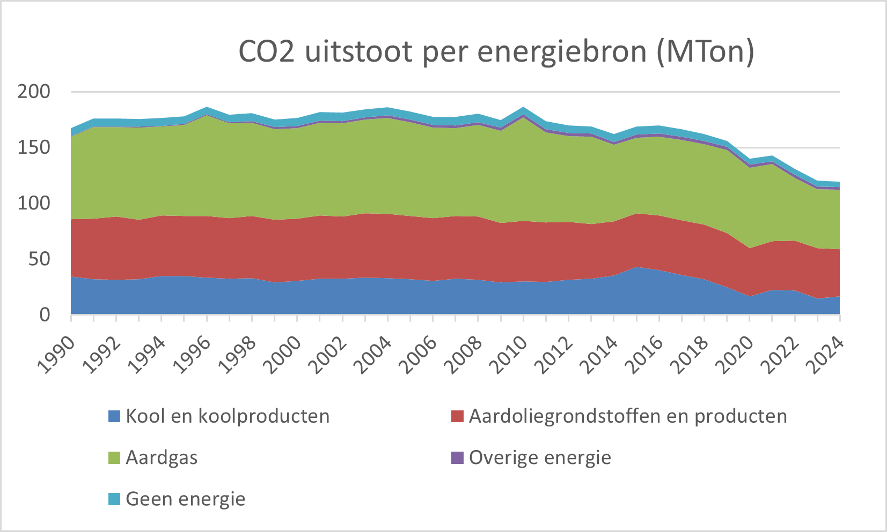
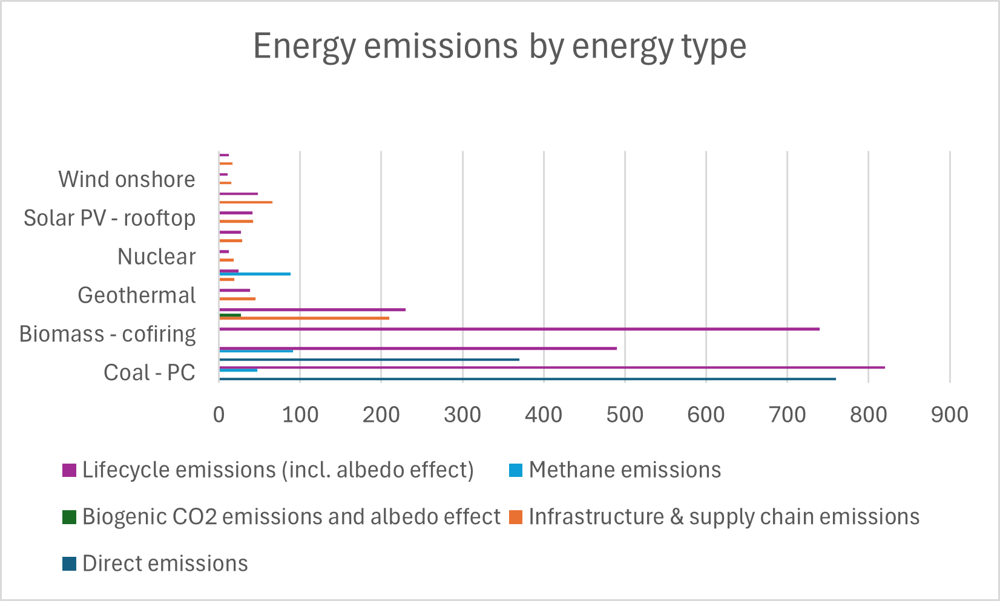

# Kernenergie

## Graphs

[2]

Dit is een grafiek van co2 uitstoot per sector. Hiertussen staan alleen fossiele opwekkingsmethodes. Hieruit is te zien dat wij in Nederland een daling maken in de hoeveelheid CO2 uitstoot die wij produceren, maar dat dit geen scherpe daling is. Verder is te zien dat deze daling vooral veroorzaakt wordt door de vermindering van steenkoolgebruik, waar dit eigenlijk een daling moet zijn van alle fossiele brandstoffen en uitstoot in het algemeen.

[4]

In deze grafiek is de co2 uitstoot van verschillende energiebronnen te zien. Naast het feit dat groene energie natuurlijk erg schoon is vergeleken met fossiele brandstoffen, is er ook te zien dat kernenergie een van de, als niet de schoonste algemene manier van energieopwekken is, over een langere periode.

## Volgende plannen

Verder wil ik in mijn data story iets vertellen over kosten per kilowattuur, en grid base load, maar hiervoor zijn grafieken wat moeilijker te vinden, dus die laat ik in dit concept even weg.

In het algemeen is het verhaal over de grid base load dat wind en zonne-energie niet altijd consistent energie opwekken. De zon schijnt 's nachts namelijk niet, en al lijkt het wel zo, de wind waait niet altijd. Kernenergie kan dus dat gat opvullen, en juist de consistente opwekking leveren om een stroomnet te laten draaien.

## Reflectie

Het opzetten van deze data heeft mij enige tijd gekost. Ik heb namelijk nog nooit echt op deze manier met data gewerkt. Ik heb het natuurlijk wel geciteerd, maar deze excel grafieken waren voor mij nieuwe kost. Echter was het wel erg leerzaam, en denk ik dat ik zeker in het verder ontwikkelen van mijn data story hier baat bij zal hebben.

### Bronnen
[1]https://opendata.cbs.nl/#/CBS/nl/dataset/84918NED/table?defaultview  
[2]https://www.cbs.nl/nl-nl/maatwerk/2025/37/energie-en-broeikasgassen-1990-2024 (Tabel 6b)  
[3]https://www.cowi.com/news-and-press/news/2023/comparing-co2-emissions-from-different-energy-sources/  
[4]https://www.ipcc.ch/site/assets/uploads/2018/02/ipcc_wg3_ar5_annex-iii.pdf#page=7  
[5]https://www.sciencedirect.com/science/article/pii/S0160412096001122  
[6]https://unece.org/sites/default/files/2021-09/202109_UNECE_LCA_1.2_clean.pdf  
[7]https://ecoquery.ecoinvent.org/3.2/cutoff/dataset/212/documentation  
[8]https://inis.iaea.org/records/0m67v-1jm58  