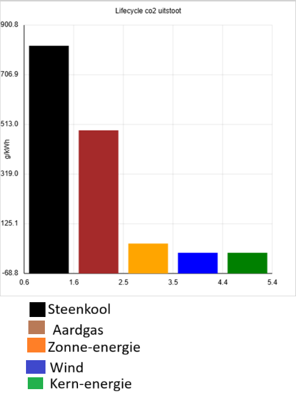
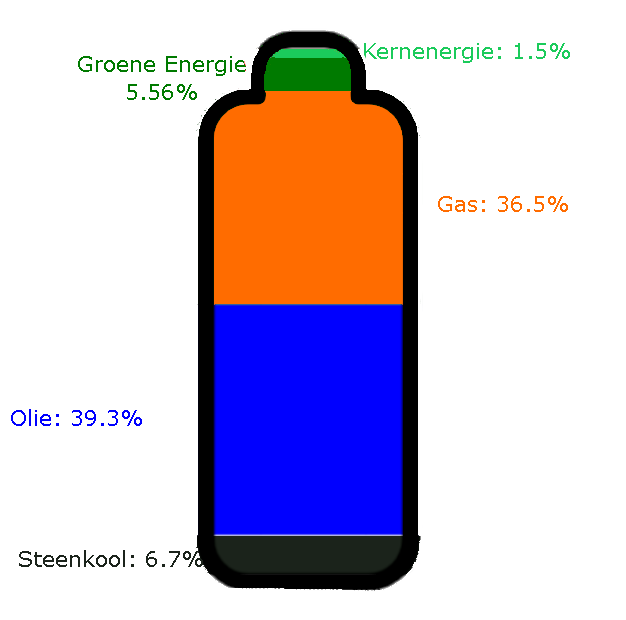
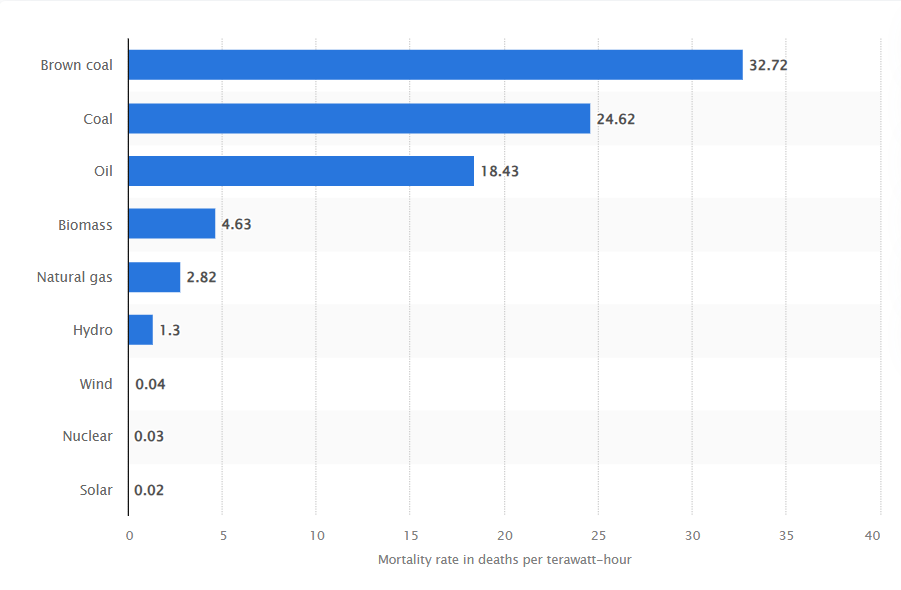

# Kernenergie

## Graphs

### Co2 uitstoot

[2]

Dit is een grafiek van co2 uitstoot per sector. Hiertussen staan alleen fossiele opwekkingsmethodes. Hieruit is te zien dat wij in Nederland een daling maken in de hoeveelheid CO2 uitstoot die wij produceren, maar dat dit geen scherpe daling is. Verder is te zien dat deze daling vooral veroorzaakt wordt door de vermindering van steenkoolgebruik, waar dit eigenlijk een daling moet zijn van alle fossiele brandstoffen en uitstoot in het algemeen. Ook is het efficientier maken van energieopwekking en gebruik heeft de proporties niet veranderd. Er moet dus iets anders gebeuren.

[4]

In deze grafiek is de co2 uitstoot van verschillende energiebronnen te zien. Naast het feit dat groene energie natuurlijk erg schoon is vergeleken met fossiele brandstoffen, is er ook te zien dat kernenergie een van de, als niet de schoonste algemene manier van energieopwekken is, over een langere periode.

Totale opwek energie: 2.576.091 Terra Joules 

In deze grafiek is te zien dat de energiemix van nederland nog steeds grotendeels uit fossiele brandstoffen bestaat.[10]

Dit betekent dat wij alsnog gigantisch veel co2 uitstoten, ondanks de gigantische stappen in vergroening die zijn gemaakt in de laatste jaren. Waarom dan?

**Door stabiliteit!**
De zon schijnt natuurlijk niet in de nacht. En soms is het bewolkt. Dit veroorzaakt een fenomeen dat een [duck curve](https://en.wikipedia.org/wiki/Duck_curve) heet!

Dit fenomeen betekent dat een zonnecentrale overdag veel produceert, maar niet in de ochtend en de avond. Hierdoor is het moeilijk om een stroomnet in balans te krijgen; Je moet erg veel compenseren rond 9 uur, en 7 uur 's avonds, maar je hebt die extra capaciteit niet de hele dag nodig. Centrales klaar laten staan zonder die te gebruiken is erg duur, en grootschalige opslagmogelijkheden zijn er simpelweg niet.  

Kernenergie heeft dit probleem niet! Kernenergie produceert op elk moment precies zoveel als je wilt. Het is een stabiel systeem!

### Afval
Maar wat dan van de afval?

In totaal is er ooit 9283 kubieke meter 'high-level' kernafval geproduceerd. Hiervan is 3960 kubieke meter veilig vernietigd. Er blijft dus 5232 kubieke meter over. Dit is ongeveer de gasinhoud van deze zeppelin. [11]
.jpg)

Klinkt als erg veel! Maar daarmee produceren we 10% van de energie voor de hele wereldbevolking![12] Ter vergelijking, produceren we 27.8% van onze energie met steenkool. Hiervoor verbranden we 8025 miljoen ton steenkool, en produceren we 15.4 miljard ton co2 per jaar! En dat nummer gaat steeds omhoog![14]

Dat is 7.780.000.000.000 kubieke meter! Ofwel, 1.364.912.280 van die zeppelins! Dus, heb je liever een zeppelin ooit in de grond, of 1.3 miljard zeppelins in de lucht?

### Veiligheid
Iedereen kent de grote kernrampen wel. Maar die zijn erg zeldzaam. Per terawatt-uur is het de op-een-na-veiligste grote energiebron, achter zonne-energie.[15]

 
bron: Statista

Dus hoewel kernrampen groot nieuws zijn, is het geen grote zorg.

### Conclusie
Kernenergie stoot dus net zo weinig uit als de groenste groene energie, produceert vrij weinig afval (5232 kubieke meter / 80 jaar = 65.4 kubieke meter per jaar), en is ultra stabiel in het opwekken van elektriciteit. Er hoeft geen opslag grootschalige energie-opslag gebouwd worden, de aarde warmt er niet van op, en het is nog veilig ook. Dus waarom niet kern-energie?

### Bronnen
[1]https://opendata.cbs.nl/#/CBS/nl/dataset/84918NED/table?defaultview  
[2]https://www.cbs.nl/nl-nl/maatwerk/2025/37/energie-en-broeikasgassen-1990-2024 (Tabel 6b)  
[3]https://www.cowi.com/news-and-press/news/2023/comparing-co2-emissions-from-different-energy-sources/  
[4]https://www.ipcc.ch/site/assets/uploads/2018/02/ipcc_wg3_ar5_annex-iii.pdf#page=7  
[5]https://www.sciencedirect.com/science/article/pii/S0160412096001122  
[6]https://unece.org/sites/default/files/2021-09/202109_UNECE_LCA_1.2_clean.pdf  
[7]https://ecoquery.ecoinvent.org/3.2/cutoff/dataset/212/documentation  
[8]https://inis.iaea.org/records/0m67v-1jm58  
[9]https://www.iea.org/data-and-statistics/charts/global-coal-consumption-2000-2025> 
[10]https://www.iea.org/countries/the-netherlands/energy-mix 
[11]https://www.visualcapitalist.com/visualizing-all-the-nuclear-waste-in-the-world/ 
[12]https://www.iea.org/world/energy-mix 
[13]https://www.ourworldindata.org/grapher/annual-co2-coal 
[14]https://www.iea.org/data-and-statistics/charts/global-coal-consumption-2000-2025 
[15]https://www.statista.com/statistics/494425/death-rate-worldwide-by-energy-source/

## Reflectie

Doordat ik erg druk ben geweest, en een periode zeer ziek ben geweest, heb ik minder tijd kunnen gebruiken voor deze opdracht. Echter had de tijd die ik wel had voldoende geweest, als ik de juiste prioriteiten had gesteld. Ik heb een onderwerp gekozen waar erg moeilijk data voor te vinden is, waardoor ik erg veel tijd kwijt ben geraakt aan de data vinden.

Verder ben ik te ambitieus geweest met de visualisatie. Ik heb verreweg de meeste tijd gestoken in het zelf laten zien van grafieken, terwijl dit in het eindproduct eigenlijk niet te zien is. Ik heb hier niet per se spijt van, omdat dit erg leerzaam was en goed is voor mijn tech-portfolio, maar het is wel een les voor de volgende keer.

Als ik dit opnieuw zou mogen doen, dan zou ik een ander onderwerp kiezen. Daarnaast zou ik alle tijd steken in het visualiseren van de grafieken, en deze mooi maken. Ik zou niet een eigen graphing-tool schrijven. Dat was mijn grote fout.