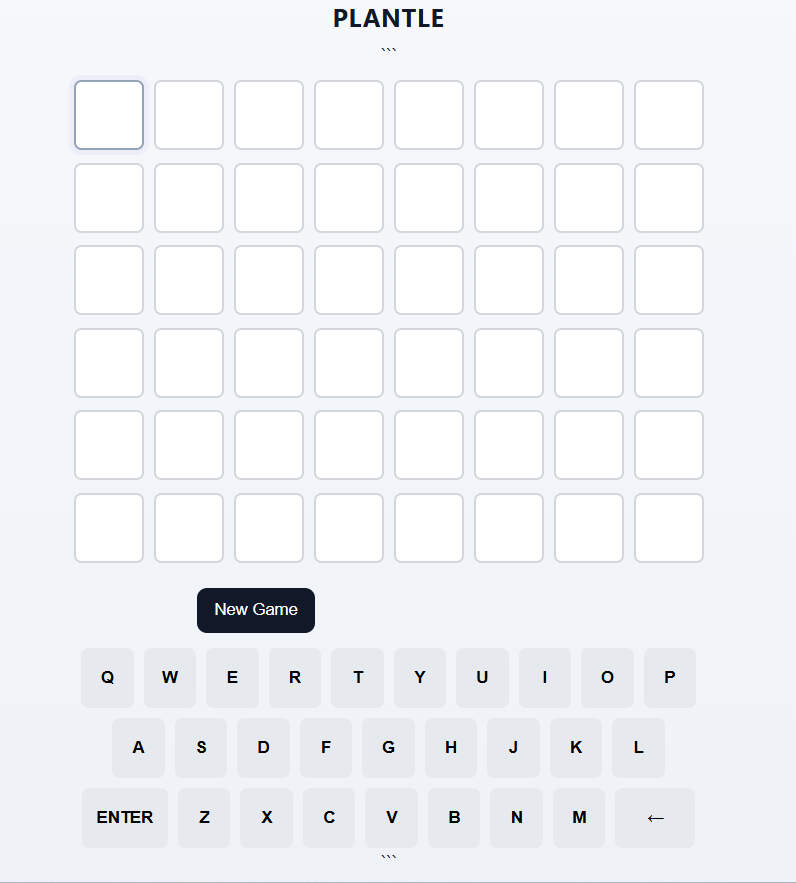

# iNaturalist data-driven redesign
Berend Broesder

## Data & Visualisatie
Mijn bijdrage aan de data was het kiezen van de dataset [EUPVP Official List.xlsx](https://ec.europa.eu/food/plant-variety-portal/index.xhtml;jsessionid=wyPVWaBS9Kjhg28GIoDmPTZX60iIzCNyLKoOuPLPvokwOymQ5vux!150115978). Dit is een dataset die alle planten van de EU bevat. Mijn grootste Wrangling aspect ligt dan ook in het filteren van de dataset om deze te verkleinen tot een acceptabel formaat. Ik heb dit gedaan met de online tools, door onderzoek te doen naar bepaalde aspecten. Zoals of een plant gevonden is, of ingestuurd is. Of op nationaliteit, en op nationaal ID.

## Algoritme
Ik heb voor de werking van het programma twee dingen opgeleverd:
* Trainingsdata  
Mijn bijdrage aan het algoritme lag vooral op het veld van de trainingsdata. Wij hebben beter kunnen richten op de planten die nodig zijn voor onze app door te filteren met de dataset die ik uit de EU website heb getrokken.

* API-test  
Voor het initiele concept van het gebruiken van de iNaturalist API heb ik een [simpel API-testprogramma](https://github.com/BerendStudent/portfolio-big-data-and-design/blob/master/inaturalist/test/test.py) opgeleverd. Dit gebruikt data van de KNMI, die opgevraagd en teruggeleverd wordt op een complexe manier. Hierdoor kon ik meer informatie opdoen over het gebruik van een API.

## Uitbreiding
Mijn uitbreiding lag vooral in het Wordle-gedeelte. Ik heb hiervoor meerdere dingen opgeleverd:
* Eerste experiment voor Wordle-style game  
Dit bestond uit een [elementaire Python-applicatie](https://github.com/BerendStudent/portfolio-big-data-and-design/blob/master/inaturalist/test/quiz_test.py) voor het testen van de simpele Quiz-logica
* Plant-filtering op basis van een gegeven dataset  
Op basis van de dataset filter ik voor planten die in het specifieke gebied te vinden zijn. In dit geval was dat Nederland. Hiervoor moest ik de dataset opschonen van lege en fout geformatteerde cells, en daarna de conventionele namen omzetten tot een juiste list.
* Flask-app voor het leveren van game-instructies en gefilterde data naar de front-end  
Ik heb een [Flask app](https://github.com/BerendStudent/portfolio-big-data-and-design/blob/master/inaturalist/code/gui/app.py) gemaakt voor het leveren van de data naar een bruikbare front-end. Hiervoor moest ik oppassen dat ik alleen de noodzakelijke data mee stuurde, zodat de data-overgang makkelijk te gebruiken was. Ook moest ik gebruik maken van sessies, een nieuw systeem voor mij wat het mogelijk maakt om meerdere individuele uitkomsten voort te laten komen uit dezelfde Flask-code.
* Een front-end voor het spelen van de game  
Ik heb ook een front-end gebouwd doormiddel van [html](https://github.com/BerendStudent/portfolio-big-data-and-design/blob/master/inaturalist/code/gui/templates/index.html)-[css](https://github.com/BerendStudent/portfolio-big-data-and-design/blob/master/inaturalist/code/gui/static/style.css)-[javascript](https://github.com/BerendStudent/portfolio-big-data-and-design/blob/master/inaturalist/code/gui/static/quiz.js). Doormiddel van deze front-end is het makkelijk voor normale mensen om te interacteren met de data die ik uit de dataset heb gehaald. De bedoeling van Plantle is om een element van Gameification toe te voegen aan iNaturalist, zodat mensen gemotiveerd zijn om deze te blijven gebruiken, en ook vooral herrinnerd worden aan de planten die ze al langer geleden gescand hebben.

## Vervolgsstappen
Er zijn meerdere vervolgsstappen nodig om mijn contributie te laten werken met de iNaturalist app:
1. Integratie  
Momenteel bestaat er nog geen iNaturalist front-end, alleen een design. Daarom is mijn Plantle project nog volledig vrijstaand. Zodra er een unified-front-end komt, moet ik Plantle daarmee integreren.
2. Plantle werkend maken met het plantenboek  
Een cruciaal aspect van Plantle is dat deze gespeeld word op basis van de planten in het plantenboek. Zo kunnen wij mensen laten denken over planten die ze misschien al een tijdje geleden gescand hebben, en blijven ze dus geinteresseerd in de natuurlijke omgevingen die ze al ontdekt hebben.

## Leerpunten
Mijn leerpunten zijn als volgt:
* Flask-sessies
* Werken met Excel
* Integratie Pandas met Excel
* Werken met Pandas
* Meer over HTML-CSS
* Dataset vinden op het internet
* Werken met EU datasets
* Filteren op basis van officiele characteristics
* Werken met hele grote datasets 
* Filteren van hele grote datasets op basis van echt belangrijke characteristics.

## Bijlagen
https://ec.europa.eu/food/plant-variety-portal/index.xhtml;jsessionid=wyPVWaBS9Kjhg28GIoDmPTZX60iIzCNyLKoOuPLPvokwOymQ5vux!150115978  
https://github.com/BerendStudent/portfolio-big-data-and-design/blob/master/inaturalist/test/test.py  
https://github.com/BerendStudent/portfolio-big-data-and-design/blob/master/inaturalist/test/quiz_test.py  
https://github.com/BerendStudent/portfolio-big-data-and-design/blob/master/inaturalist/code/gui/templates/index.html  
https://github.com/BerendStudent/portfolio-big-data-and-design/blob/master/inaturalist/code/gui/static/style.css  
https://github.com/BerendStudent/portfolio-big-data-and-design/blob/master/inaturalist/code/gui/static/quiz.js  
image:  
