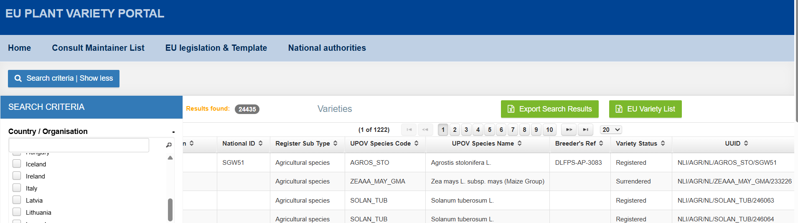
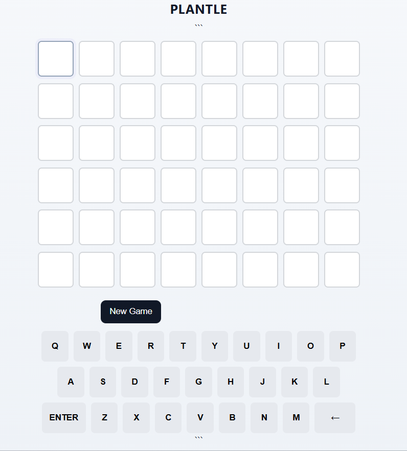

# Reflectie Double Diamond
## Introductie
In de tweede double diamond van een week heb ik met mijn team geprobeert om de app verder af te maken. Hierbij hebben wij gefocust op de aspecten die nog te doen waren in de korte tijd, omdat de double-diamond maar een week lang was, en omdat wij al een sterk design hebben kunnen opstellen in de vorige double-diamond. Echter ben ik wel trots op het resultaat, omdat we veel hebben kunnen bereiken ondanks de korte tijd.

## Discover
In deze fase zijn wij bezig geweest met het herzien van ons ontwerp, of dit nog werkt, en of ons ontwerp een goede basis vormt voor de volgende stappen.

### Acties
* Desk-onderzoek  
Ik heb geholpen met het onderzoeken van de mogelijke vormen van gameification, en of ons ontwerp voor de Wordle nog wel goed was. Hieruit bleek dat Plantle erg populair zou zijn, als dit eenmaal geimplementeerd is.
* Interviews  
Ik ben met de andere op mogelijke gebruikers af gegaan om te kijken of ons design nog wel klopte, en om te zien wat de belangrijke vervolgstappen zijn. 

### Leerpunten
In deze Discover fase heb ik geleerd dat het belangrijkste punt van de Gameification is dat het simpel te gebruiken is, en dat het spel niet te moeilijk is. Een slechte eerste-ervaring zorgt veelal dat de speler niet terugkomt, en dit is makkelijk te voorkomen door het ontwerp te maken met een onwetende gebruiker als doelgroep.

## Define
In de define-fase ben ik bezig geweest met het samenstellen van de eisen voor Plantle. 

### Acties
* Plantle eisen opgesteld  
Ik heb kritisch gekeken naar de eisen voor de Plantle-uitbreiding. De conclusie hiervan is dat dit makkelijk te gebruiken moet zijn, een simpele interface heeft, en makkelijk te gebruiken moet zijn.

* Dataset gevonden voor Plantle  
Ik heb onderzoek gedaan naar datasets voor de planten die mogelijk gebruikt kunnen worden voor Plantle.

* Wordle-stijl onderzocht  
Ik heb onderzoek gedaan naar de stijl en layout die Wordle en soortgelijke apps gebruiken. Hieruit blijkt dat de winnende combinatie is om simpelweg een toetsenbord en een speelveld te hebben, en niks meer dan dat.

* Plantle wireframe gemaakt 
Ik heb een wireframe gemaakt voor mijn Plantle-uitbreiding. Hiermee heb ik het design geverifieerd en een goed doel gesteld voor het maken van de Plantle game.  
  
Ik heb een wireframe gemaakt voor mijn Plantle-uitbreiding. Hiermee heb ik het design geverifieerd en een goed doel gesteld voor het maken van de Plantle game

### Leerpunten
Doormiddel van deze acties heb ik geleerd dat simpliciteit echt voorop staat in het ontwerpen van een simpele game. Hierdoor worden mensen niet weggejaagd door een complexe interface, en worden die aangetrokken door direct te kunnen starten met spelen.

## Develop
In de develop fase ben ik met mijn groepje bezig geweest om het echte ontwerp uit te gaan voeren. Hiervoor hebben wij meerdere stappen doorlopen: 

### Acties
* Verwerken Plantle wireframe tot front-end  
Ik heb de Plantle-wireframe 1-op-1 omgezet tot een werkende frontend

  

* Plantle dataset gekozen  
Ik heb uiteindelijk gekozen om de EUPVP platen dataset te gebruiken voor de Plantle-woorden.[1] Hierbij heb ik gelet op de beschikbaarheid, betrouwbaarheid, en ethiek om de data heen. Ik heb gekozen voor de EU dataset, omdat deze erg betrouwbaar is en vrij is te gebruiken. 
  

### Leerpunten
In deze develop-fase heb ik geleerd dat niet alle data even ethisch is, en dat ik goed op moet letten waar ik het vandaan haal. Ik ben datasets tegen gekomen die opgehaald zijn uit web-scraped fotos. Dit wil ik natuurlijk niet in mijn project gebruiken, en ik zal in de toekomst beter op de hoede zijn voor dit soort gekkigheden.

## Deliver
In deze double diamond heb ik mij geheel gefocust op het opleveren van Plantle, en de onderdelen daarvan.

### Acties
* Plantle gemaakt  
Ik heb in deze Double Diamond Plantle kunnen opleveren. Dit is het Gameification-onderdeel van onze iNaturalist redesign. Plantle bestaat uit een volledig werkende frontend-backend combinatie, gemaakt met Flask, HTML-CSS-Javascript, en een Excel-dataset voor de planten.

* Plantle Wireframe  
Ik heb een wireframe kunnen opleveren voor het ontwerp van Plantle. Hiermee heb ik tests kunnen uitvoeren om te zien of het ontwerp simpel en makkelijk te begrijpen is.  

* Plantle frontend  
Ik heb in deze 1-week Double Diamond Plantle op kunnen leveren. Dit heb ik gedaan door eerst Wireframes te maken, een Flask app [2] te bouwen voor de logica, en daarna heb ik er een frontend voor gebouwd[3] 

  

* Plantle test  
Ik heb Plantle aan meerdere klasgenoten laten zien, en hiermee het ontwerp geverifieerd. Vrijwel iedereen leek dit te begrijpen, en het design blijkt een success.

### Leerpunten
In het opleveren van Plantle heb ik geleerd om beter wireframes te maken, en om beter met html-css-javascript om te gaan. Ook heb ik geleerd om beter gebruik te maken van gameification, simplicity, en om beter mijn ontwerp te testen.

## Bijlagen
[1] https://ec.europa.eu/food/plant-variety-portal/index.xhtml;jsessionid=wyPVWaBS9Kjhg28GIoDmPTZX60iIzCNyLKoOuPLPvokwOymQ5vux!150115978  
[2] https://github.com/BerendStudent/portfolio-big-data-and-design/blob/master/inaturalist/code/gui/app.py  
[3] https://github.com/BerendStudent/portfolio-big-data-and-design/blob/master/inaturalist/code/gui/templates/index.html  
